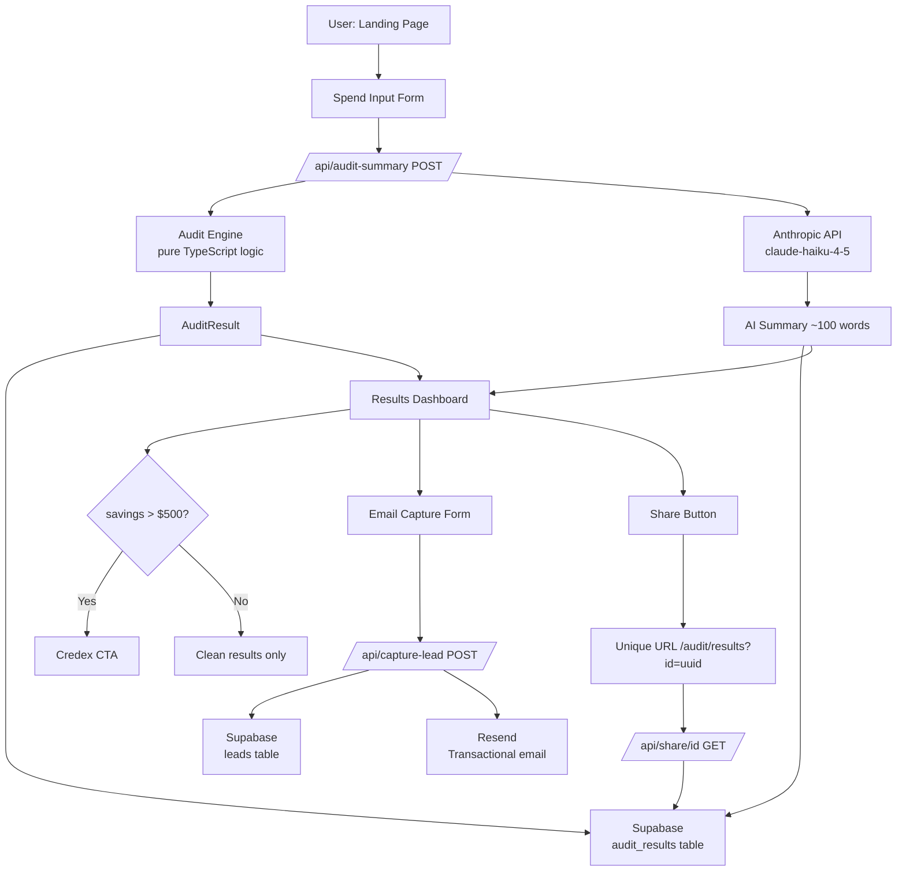

# Architecture

## System Overview



---

## Data Flow

```
[Browser Form]
      │
      │ POST /api/audit-summary
      │ { tools: ToolEntry[] }
      ▼
[API Route: audit-summary]
      │
      ├──► runAudit(input)          ← pure function, zero side effects
      │         │
      │    ┌────┴─────────────────────────────────────────┐
      │    │ Per-tool auditors:                            │
      │    │  auditCursor()      → Recommendation | null   │
      │    │  auditCopilot()     → Recommendation | null   │
      │    │  auditClaudeSub()   → Recommendation | null   │
      │    │  auditChatGPTSub()  → Recommendation | null   │
      │    │  auditGemini()      → Recommendation | null   │
      │    │  auditOpenAIApi()   → Recommendation | null   │
      │    │  auditAnthropicApi()→ Recommendation | null   │
      │    └────────────────────────────────────────────── ┘
      │         │
      │    AuditResult {
      │      totalCurrentSpend,
      │      totalEstimatedSaving,
      │      recommendations[],
      │      credexCtaVisible     ← true if saving >= $500
      │    }
      │
      ├──► Anthropic claude-haiku-4-5
      │         │
      │    aiSummary: string (~100 words)
      │
      ├──► Supabase INSERT audit_results
      │         { id: uuid, result: JSON, ai_summary: string }
      │
      └──► Response to browser
               { ...AuditResult, aiSummary, auditId, createdAt }
```

---

## Database Schema

### `audit_results`
| Column | Type | Notes |
|--------|------|-------|
| `id` | `uuid` | Primary key, used for share URLs |
| `result` | `jsonb` | Full AuditResult object |
| `ai_summary` | `text` | Anthropic-generated summary |
| `created_at` | `timestamptz` | Auto-set |

### `leads`
| Column | Type | Notes |
|--------|------|-------|
| `id` | `uuid` | Primary key |
| `email` | `text` | Captured email |
| `audit_id` | `uuid` | FK → audit_results.id |
| `total_spend` | `integer` | Monthly spend at capture time |
| `total_saving` | `integer` | Estimated saving at capture time |
| `created_at` | `timestamptz` | Auto-set |

---

## Audit Engine Design

The audit engine is a **pure function** — no I/O, no side effects, fully testable:

```typescript
runAudit(input: AuditInput): AuditResult
```

### Design principles
1. **Per-tool auditors** — each tool has an isolated auditor function. Adding a new tool = add one function + one entry in the `AUDITORS` map.
2. **All pricing constants at top of file** — one place to update when vendor prices change.
3. **Source citations on every recommendation** — each `Recommendation` object carries `sourceUrl` and `confidence` level.
4. **Conservative estimates** — where ranges exist, lower bound is used. API savings use 60% batchable assumption.
5. **Disabled = skipped** — tools the user didn't select contribute $0 to any calculation.

### Confidence levels
| Level | Meaning |
|-------|---------|
| `high` | Price ratio is published, condition is objective (e.g. plan tier, model name) |
| `medium` | Recommendation depends on usage pattern assumption |
| `low` | Cross-tool comparison where use-case fit is uncertain |

---

## Component Map

```
app/
├── page.tsx              Landing — hero, how-it-works, CTA
├── audit/
│   ├── page.tsx          Spend Input Form
│   │    ├── Tool toggle cards (enabled/disabled)
│   │    ├── Per-tool expanded fields (plan/seats/model/useCase)
│   │    └── Submit → POST /api/audit-summary
│   └── results/
│       └── page.tsx      Results Dashboard
│            ├── Hero savings card
│            ├── AI Summary block
│            ├── Recharts bar chart
│            ├── Recommendation cards
│            ├── Credex CTA (conditional, $500 threshold)
│            └── Email capture form → POST /api/capture-lead
└── api/
    ├── audit-summary/route.ts   Orchestrator
    ├── capture-lead/route.ts    Lead storage + email
    └── share/[id]/route.ts      Public read of stored audit
```

---

## Deployment

- **Platform:** Vercel (Next.js first-class)
- **CI:** GitHub Actions (test → lint → build pipeline)
- **Secrets:** Set in Vercel dashboard + GitHub repo secrets
- **Database:** Supabase cloud (free tier)
- **Email:** Resend (free tier: 3,000 emails/month)
